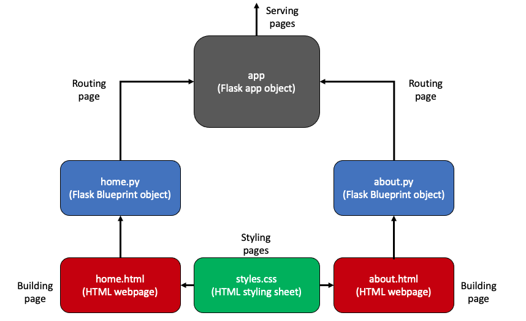
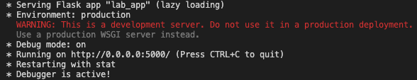

# Flask app concepts

Flask is a Python library that allows you to get a web app up and running very quickly.

It is centred around a single Flask `app` object which has routes to various `Blueprint` objects (collections of Python code, HTML elements and CSS styling).

In each Blueprint there can be multiple functions, but only one of them will have a special decorator (more on that later) which tells the Flask object what page this Python function is responsible for.

These decorated functions return a specific HTML page (i.e. a home page, an about page etc.) which is styled using a single `styles.css` sheets (more on that later too).



## Running the app

1) Open a terminal window and navigate to the top level `lab_app` directory
2) Run `python3 -m venv env`
3) Run `source env/bin/activate`
4) Run `pip3 install -r requirements.txt`
5) Navigate to the `lab_app` folder containing the `wsgi.py` file.
6) Type `python3 wsgi.py` into the terminal

You should see the following in your terminal window, and you can monitor incoming requests (and errors) underneath this:



7) Head over to `0.0.0.0:5000` in your web browser

## Understanding the Flask app structure
```
. (the root directory of your app, lab_app in this case)
├── config.py (5)
├── wsgi.py (6)
├── lab_app/
    ├── __init__.py (1)
    ├── about
        ├── __init__.py
        ├── about.py
        └── templates/
            └── about.html
    ├── home
        ├── __init__.py
        ├── home.py (2)
        └── templates/
            └── index.html (3)
    └── static
        └── styles/
            └── styles.css (4)
```
## 1) The lab_app `__init__.py`

Counter-intuitively, we're not starting from the top or bottom of the file structure, but somewhere in the middle. This is probably our most important file as it defines the function that creates our app.

1) We import `Flask`, a Python web application framework.
2) We then define our `create_app()` function, in it we define the `app` variable as a Flask object with various settings for behind-the-scenes magic:
```python
app = Flask(__name__, instance_relative_config=False)
```
3) After defining the root `app` Flask object, we then use `Blueprints` to define our pages:

```python
    with app.app_context():
        # Include our routes
        from .home.home import home
        from .about.about import about

        # Register Blueprints
        app.register_blueprint(home)
        app.register_blueprint(about)
```

Here we're actually importing other modules that we've defined: namely the `home` and `about` modules, from the `/home/home.py` and `about/about.py` Python files, respectively (in this case Python is using `.` instead of `/` to find the modules).

These Python files define Flask Blueprints, which are effectively collections of elements (i.e. Python functions, HTML pages and styling elements). Blueprints are the building blocks of a Flask app, and allow you to build an app with distinct components (in this case a `home` page and an `about` page).

4) Finally, we return the Flask `app` object we've just defined and this is assigned to whatever variable is on the receiving end of this method call.

```python
        return app
```

*NOTE: Don't worry about the `__init__.py` files in the subdirectories, they're empty and used behind-the-scenes for routing and importing Blueprints*

## 2) Blueprints: The home `home.py`

This is a Python file in which we create a Blueprint (i.e. a page for our web app). First, we import a few modules:

```python
from flask import Blueprint, render_template
from datetime import datetime
```

We then register this Python file as a Flask Blueprint object:

```python
about = Blueprint('about', __name__, template_folder="templates", static_folder='../static')
```

We call the `Blueprint` function, provide a name for our blueprint, the import name (`__name__`) for behind-the-scenes routing, a templates folder (where we store the HTML we want to render) and a static folder (for styling and JavaScript functions). This `Blueprint` object then gets assigned to `about`.

Next we define our back-end functions, such as `get_time()` and finally `index()`, which will be what the browser hits when we start our app and head to `localhost:5000`.

### Python Decorators

Notice that `index()` has a line above it starting with a `@`, this is known as a decorator. Decorators are used to change how Python functions behave. In this case we're using a Flask decorator to do 2 things:

1) Bind this particular function to an app route, in this case we're telling Flask to call this `home.index()` function when we go to `localhost:5000`. Look at the `about.py` and notice the difference, they're we're defining the function to be called when the user goes to `localhost:5000/about`.
2) Define the HTTP methods allowed by the function (in this case `GET`)

## 3) HTML pages

HTML pages are just a collection of static elements (i.e. headers/titles, paragraphs, text bodies etc.) denoted by tags (i.e. <H1>Header 1</H1>)

I'm flagging so I'll come back to this later.

## 4) CSS files

You **can** style your HTML elements by adding style information within the tags of HTML files. In practice this is messy as if you decide to change things (i.e. font size, font family etc.) you have to change the style references everywhere.

Enter Cascasing Style Sheets (CSS). These are collections of style information for all your tags.

For instance, let's say in our `index.html` and `about.html` we have some headers that we want to be 100px in font size:

`index.html`:
```html
<H1 style="font-size:100px">Homepage</H1>
```

`about.html`:
```html
<H1 style="font-size:100px">About Page</H1>
```

If we have loads of files this is a real pain to change everywhere, so instead we have a `styles.css` file with a single definition:

```css
H1 {
    font-size: 10px;
}
```

If we want a style to be used by all elements (i.e. `font-family`), we use the asterisk to indicate it's a global style:

```css
H1 {
    font-family: verdana;
}
```

### Classes

What if you want multiple headers to share some stylings but not others? Consider the earlier example, but this time we want the headers in our `home` and `about` pages to be the same font size but different colours. In HTML we could do this:

`index.html`:
```html
<H1 style="color:blue">Homepage</H1>
```

`about.html`:
```html
<H1 style="color:red">About Page</H1>
```

`styles.css`:
```css
H1 {
    font-size: 10px;
}
```

What we've got here are classes of the same Header element type with a common attribute (font size), but different font colours. Since they're different classes we can use the `class` HTML attribute, like so:

`index.html`:
```html
<H1 class="homepage_header">Homepage</H1>
```

`about.html`:
```html
<H1 class="aboutpage_header">About Page</H1>
```

`styles.css`:
```css
H1 {
    font-size: 10px;
}

H1.homepage_header {
    color: blue;
}

H1.aboutpage_header {
    color: red;
}
```

Note the `.` notation to access a class.

If you make changes to your CSS file, these won't immediately be reflected in your browser. In Chrome you have to reset the cache with `CMD + SHIFT + R` or in Safari with `SHIFT + REFRESH BUTTON`.

## 5) `config.py`

This file is pretty small, and in it we're defining the configuration settings for our Flask app. One useful setting to have on when developing an app is `TEMPLATES_AUTO_RELOAD = True`, which will reload your whole app whenever you make a change to a `.py` file and save it. A nice little timesaver.

### 6) `wsgi.py`

`wsgi` is a web server framework and should be the filename if you're wanting to serve your app via the web. This is because other files using `wsgi` protocols will look for a `wsgi.py` file (and other files, i.e. `*.ini` for socket binding information).

In some tutorials this file is named `app.py`, and does the same thing so if you're just developing locally and want to run your app on `localhost:5000` then you can rename the file to `app.py` instead.

In either case, the file does a handful of things:

1) It imports your the `create_app()` function from the `lab_app` directory
   
```python
from lab_app import create_app
```

2) It uses this function to create a Flask object named `app`

```python
app = create_app()
```

3) When you run the command `Flask run` from this directory, all our behind-the-scenes magic is culminated in:

```python
if __name__ == "__main__":
    app.run(host='0.0.0.0')
```

This tells Flask to run on `localhost` IP address 0.0.0.0.