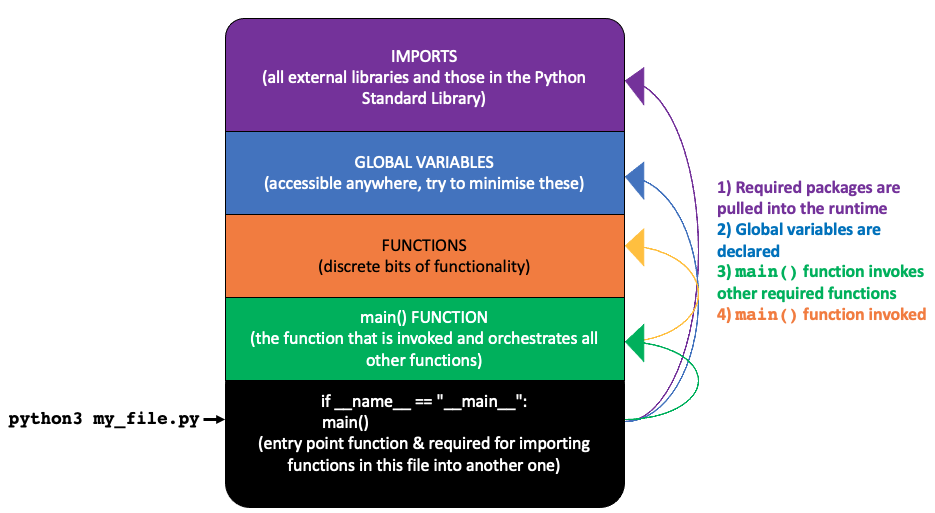

# Anatomy of a standard Python file



## Imports
Import statements usually go at the top.

When you install Python it comes with the Python Standard Library. These are a collection of libraries (also known as packages or modules) containing functions that allow you to do clever things.

There are more than 200 of these standard modules (as of Python 3.9.2), so we have to explicitly import the ones we want to use because if Python were to have all of these loaded into memory at runtime (i.e. the time when the script runs) then it would be computationally inefficient and insanely slow, as your script will only use a handful of modules. For instance:

```python
import csv
```

Would pull in the `csv` library when you invoke your script. You would then use the functions & methods contained within the `csv` library within your script with something like `csv.reader()` (i.e. the `reader()` function within the `csv` library).

*A quick note on functions and methods: they're basically the same thing, except a method is a function that is called on an object. For instance, the `datetime.time()` function can only be used on a `datetime` object, so technically it's a method.*


Sometimes you may see something like
```python
from Flask import render_template
```

These statements help keep the runtime less bloated by only importing the functions you actually want to use. In this instance, Flask is a fairly beefy library so rather than importing every function in the library you'd only import the `render_template` function. Using this syntax means you would not need to preface the function call with `Flask` (i.e. `Flask.render_template()`) and instead just call the `render_template()` function.

BEWARE when using this, as some library functions have the same name as those in the Python Standard Library, and this can lead to trouble (i.e. the `datetime` library has a function called `time`, which has different features to the standard `time` reserved function available). Reserved functions are those like `print()`, `time()` etc., and don't need to be imported because they're used so frequently. To get around this you can use aliases for imported functions, for instance:

```python
from datetime import time as Time
```

will allow you to use standard `time` function and the imported `datetime.time` function (as it has an alias of `Time`).


In addition to those available in the standard library, people are constantly creating new modules and making them available via various package managers. PyPi is one of the most popular package managers, and you install packages using `pip` (or `pip3`). More on that later.

## Global variables

These are variables that are declared outside the scope of functions and are therefore accessible anywhere. The use of these should be minimised as much as possible.

## Creating functions

Functions are great because they allow you to break your script down into discrete bits, each doing certain things.  They're useful because they have a property known as scope, which helps you cut down on the number of variables currently in use (& therefore in memory).

Python has performs something known as "Garbage Collection" behind-the-scenes, and this is an important factor in memory management. Whenever a function has finished running, the variables within the function scope are destroyed and the memory allocated to them is freed up. Jupyter Notebooks tend to be memory-heavy because without functions everything is a global variable, so getting into the practice of creating functions at the top of your Notebooks helps prevent sending your computer into orbit from excessive memory usage.


Let's look at the first function in the `typical_python.py` file:

```python
def open_csv(file_name):
    '''Opens a file an returns lines as a list object
    
    Parameters
    ------
    file_name: `string`
    
    Returns
    ------
    lines: `list`
    '''

    lines = []
    with open(file_name, 'r', newline='') as csv_file:
        open_file = csv.reader(csv_file, delimiter=',')
        for line in open_file:
            lines.append(line)

    return lines
```

### `def` keyword (required )& parameters (optional)
First off, functions are created using the `def` reserved word, followed by a function name (`open_csv`) and then the arguments (or parameters) that the function accepts, in this case `file_name`.

**If a function takes no argument then you still have to follow the name with a set of empty brackets.**

*NOTE: Two important things to remember when defining functions:*
1) Include a `:` after the brackets defining the parameters or you'll receive a `SyntaxError: invalid syntax` message
2) Tab in the rest of the function or you'll get an `IndentationError: expected an indented block` message.

### `docstring` (optional)
There's then a bunch of text within two sets of triple quotes. This is called `docstring`, and means you don't have to constantly scroll back to this function definition to remember what it does, what parameters it takes and what it returns. In VSCode, if you hover over any `open_csv` reference you will see this text. It's optional but extremely useful. Try it.

### `return` statement (technically optional, but required if you need to pass variables out of the function)

This is what the function passes back after it's finished running, and the contents of this local variable are assigned to another variable.

In this case, when we call this `open_csv` function, we pass in a `file_name`, the function then uses `file_name` to do something (add the lines to a list object called `lines`) and then returns the `lines` list.

## The main() entry point
When you write a script, it's good practice to use a `main()` function to orchestrate all of your other functions. The `main()` function acts as an entry point and is defined at the bottom of the script, before the following statement block:

```python
if __name__ == "__main__":
    main()
```

This basically means: if the reserved variable `__name__` is equal to `"__main__"` then run the `main()` function. This is always true when you run the Python file from the terminal (i.e. `python3 file_1.py`) because of some behind-the-scenes magic.

This code block isn't actually necessary for a single file, but it is necessary if you want to pull functionality from one file into another (and still want to be able to run them as distinct files). For example, let's say you have two Python files, `file_1.py` and `file_2.py`, and `file_1.py` imports `file_2.py` like so:

```python
import file_2
```

When Python runs for `file_1.py` it will search for your `file_2.py` file and assign the name `file_2` from the import statement to the `__name__` variable. This means `__name__ != "__main__"` and the script won't be executed, but the methods in it are able to be "seen" (and used) by `file_1.py`.

If you were to run `file_2.py` on its own with something like `python3 file_2.py`, then `__name__` would = `"__main__"` and the code in the `main()` block would run and call all functions within it. 

## Understanding scope
When you define a function, everything within that function is contained within the function's "local" scope. This means that any variables defined and used within the function CANNOT be seen outside of the function.

Consider this simple function (functions are always written before they're called, and we're ignoring the use of a `main()` function for now):

```python
def my_function(my_variable):
    print("Local scope")
    print(my_variable)
    my_second_variable = 2
    print(my_second_variable)


some_variable = 1
my_function(some_variable)
```

Running this will result in the following being printed to the console:
```
Local scope
1
2
```
So what's happening here? We're defining a variable (`some_variable`) and setting it to `1` outside of `my_function()`. We're then calling `my_function()` and passing in `some_variable`. The local variable within the function `my_variable` now points towards `some_variable`, and is printed. Within this function, we're also assigning a second variable (`my_second_variable`) and printing it.

If we now changed the code outside of our function to this:
```python
some_variable = 1
my_function(some_variable)
print(my_second_variable)
```

we would get this error: `NameError: name 'my_second_variable' is not defined` because `my_second_variable` does not exist outside of `my_function()`.

We can, however, pass the value of `my_second_variable` to another variable outside of the function, by using the `return` statement and putting a receiving variable name and an = sign when we call the function, like so:

```python
def my_function(my_variable):
    print(my_variable)
    my_second_variable = 2
    print(my_second_variable)
    return my_second_variable


some_variable = 1
some_variable_2 = my_function(some_variable)
print("Global scope")
print(some_variable_2)
```

Running the code would then give us:

```
Local scope
1
2
Global scope
2
```

Global variables are those designated outside of any function underneath the imports and these are accessible anywhere. It's good practice to minimise the use of global variables.

## Python virtual environments

We talked about downloading packages from package managers such as PyPi using a tool like `pip` or `pip3`. This will install the package to your default Python environment (that's set up when you install Python). But it's good practice to use virtual environments if you're working on multiple projects. Virtual environments allow you to have separate Python environments, each with only the relevant packages installed.

To make a Python virtual environment, run `python3 -m venv <your_environment_name_here>` from the terminal. This calls the Python interpreter and the `-m` flag preceding the `venv` argument is telling the interpreter to make a new virtual environment, and the name after `venv` - which could be anything as long as it's all one word, i.e. `my_python_environment` - is the name of the directory storing the virtual environment.

You then activate and enter your virtual environment by running `source env/bin/activate`. Everything that happens in this environment is now isolated from any other Python environment (including the default one).

### The `requirements.txt`

The `requirements.txt` contains all the external libraries and versions necessary for your project. Suppose you have a data analysis project, this file may include:
```
matplotlib==3.4.0
numpy==1.20.1
pandas==1.2.3
scipy==1.6.2
seaborn==0.11.1
```

However, for a web development project it may look like:
```
Flask==1.1.2
Flask-MySQLdb==0.2.0
Flask-SQLAlchemy==2.4.4
Flask-WTF==0.14.3
Jinja2==2.11.2
uWSGI==2.0.19.1
wcwidth==0.2.5
Werkzeug==1.0.1
WTForms==2.3.3
```

If you clone a project from GitHub, they often come with `requirements.txt` and all you need to do is spin up a virtual environment and activate it (as above). You then run the command `pip3 install -r requirements.txt` from the same directory the `requirements.txt` file lives in, and `pip3` will install all the necessary packages for your project. Neato.

If you're creating a project from scratch and have installed some packages via `pip3`, you can view these by running `pip3 freeze` in the terminal. To save these to a file, simply run `pip3 freeze > requirements.txt` at the root folder of your project directory.


## Summary

1) Package imports go at the top of your script
2) Use functions, define them after your imports, and keep them small
3) Use docstring to make your code easier to maintain (and easier for other people to use)
4) Virtual environments are great for organising external libraries for each project